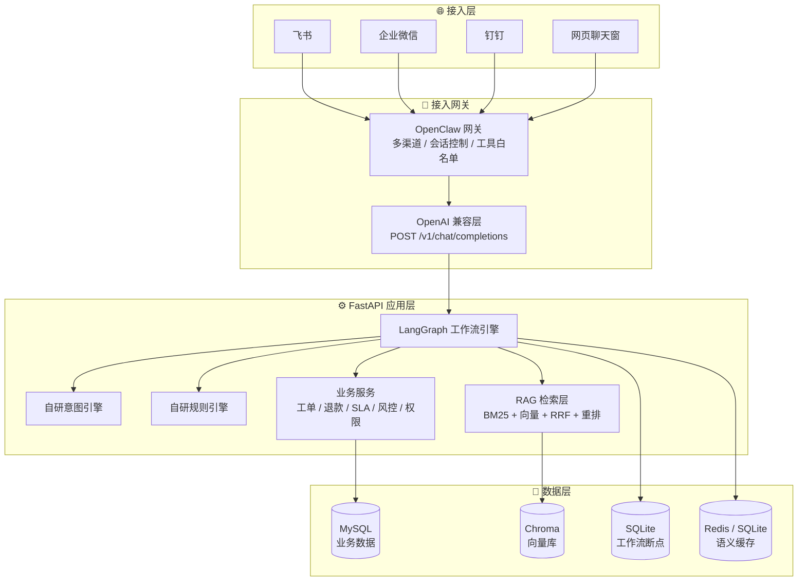
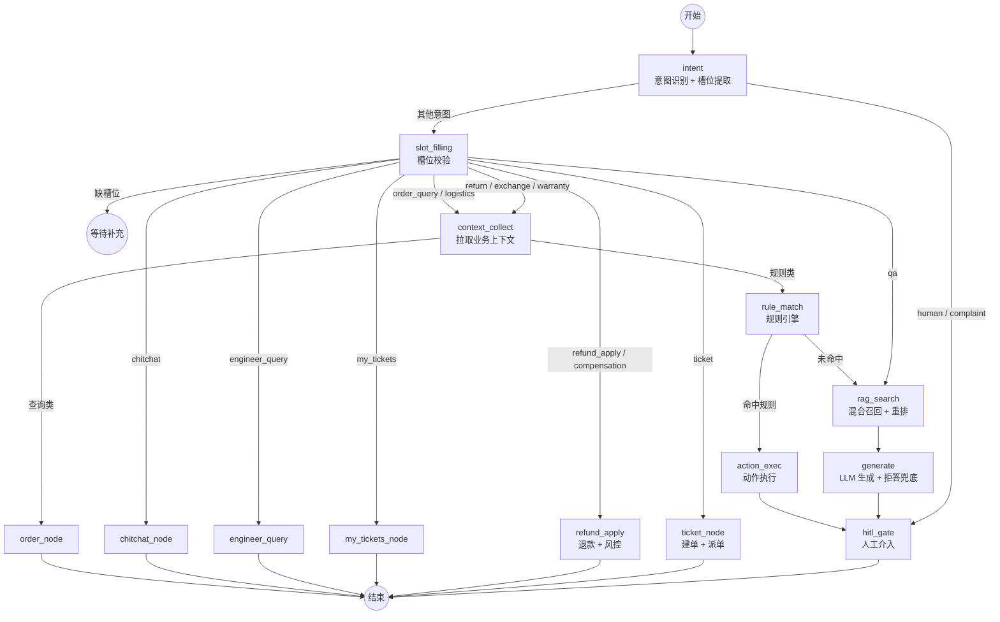
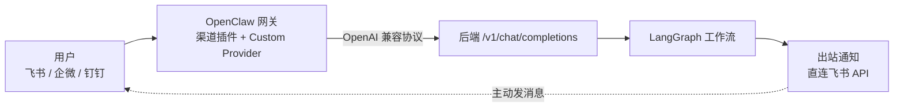

# 企业售后知识库智能问答与工单自动化 Agent 平台

> **Enterprise After-Sales Knowledge Base Agent Platform**
> 基于 **LangGraph + RAG 混合召回 + 自研规则引擎** 的企业级售后 Agent：智能问答、自动建单派单、退款风控、HITL 人工审批与多渠道接入。


**English** · An enterprise after-sales agent platform combining a LangGraph state machine, hybrid RAG retrieval (BM25 + vector + RRF + rerank), a self-built rule engine, ticket workflow automation, refund risk control and human-in-the-loop approval — with a FastAPI backend and a Vue 3 admin console.

---

## 📖 目录

- [业务背景](#-业务背景)
- [核心特性](#-核心特性)
- [系统架构](#-系统架构)
- [Agent 工作流](#-agent-工作流)
- [OpenClaw 接入](#-openclaw-接入)
- [技术栈](#-技术栈)
- [快速开始](#-快速开始)
- [配置说明](#-配置说明)
- [项目结构](#-项目结构)
- [主要 API](#-主要-api)
- [RAG 评估](#-rag-评估)
- [测试与排障](#-测试与排障)
- [Docker 部署](#-docker-部署)
- [路线图与已知限制](#-路线图与已知限制)
- [安全提示](#-安全提示)

---

## 🎯 业务背景

中小企业售后场景中，产品手册、FAQ、历史工单、订单数据分散在 PDF、Word、Excel、聊天记录与多个业务系统里，导致：

- 客服重复回答同一类问题，效率低
- 工单分派靠人工，错派、重派时有发生
- 知识更新慢，新人上手周期长
- 敏感数据不便直接调用公有云大模型

本平台把 **RAG 智能问答 + 意图识别 + 规则引擎 + 工单状态机 + 人工兜底** 串成一条闭环，并提供一套管理后台。

---

## ✨ 核心特性

### 🤖 智能问答（RAG）
- **父子块切片**：子块用于检索，父块用于生成，避免上下文被切碎
- **混合召回**：`jieba + BM25` 关键词召回 ∥ 向量召回，经 **RRF** 融合
- **余弦重排**：对融合结果做 embedding 重排取 Top-K
- **双重过滤防幻觉**：相关性阈值 **或** 实体词（型号/故障码）覆盖才放行，否则**明确拒答**而非编造
- **问题类型路由**：按「原因 / 现象 / 步骤 / 范围 / 注意事项 / 边界」分别用不同 Prompt，并对章节标题做过滤

### 🧠 Agent 编排（LangGraph）
- **17 类意图识别**（自研引擎：关键词 + 正则 + 优先级，YAML 可热加载）
- **多轮槽位填充**：缺关键字段主动追问，追问上下文可跨轮继承
- **业务上下文收集**：订单 / 物流 / 商品 / 客户资产聚合
- **HITL 人工审批**：`interrupt()` 暂停 → 对话内「同意/拒绝」→ 断点恢复，含超时自动取消
- **SQLite Checkpointer**：中断状态跨进程、跨重启保留

### 🙋 转人工客服（完整闭环）
- **工单化接管**：`queued → claimed → closed`（超时未接管自动 `timeout` 并升级通知主管）
- **AI 静默**：坐席一旦认领，该会话入站消息**不再启动工作流**，避免 AI 抢话（入口短路，不浪费 LLM 调用）
- **坐席台**：队列 / 会话消息流 / 一键认领 / 以「本人」身份回复 / 结束接管（自动插入「已转回智能助手」提示）
- **通知到人**：转人工即私聊客服群与坐席（`handoff_created` / `handoff_timeout` 事件路由）
- **会话落库**：入站/出站按条写入 `conversation_messages`（非逐 token），客服台、会话监控、常见问题分析共用一套数据
- **会话摘要**：自动附带最近几轮对话，坐席不用翻记录

### 📈 客户线索与任务进度
- **六阶段状态机**：`新建 → 已联系 → 已报价 → 谈判中 → 已成交 / 已流失`，非法流转被拒、流失必填原因
- **进度自动留痕**：每次阶段变化、报价变化、成交都**自动写一条跟进记录**，不靠人工补记
- **归属明确**：线索与客户都有负责人；销售池 = 拥有 `lead.edit` 权限的在线人员
- **自动分配**：按「销售岗优先 → 进行中线索数升序 → id」选人（复用工程师派单的负载思路）
- **AI 自动捕获线索**：命中「合作 / 采购 / 报价 / 代理」等意图时自动建线索并分配销售（同一会话幂等，不重复建）
- **漏斗统计**：各阶段数量、成交率、报价/成交金额、平均成交额、按负责人排行

### 🎫 工单与售后
- **工单状态机**：`pending → assigned → accepted → in_progress → resolved → closed`
- **自动派单**：按 `技能匹配 → 在线状态 → 负载升序` 选人；**拒单自动重派**（排除原工程师）
- **字段完整度**：允许「待补充」建单，并拦截不完整工单进入处理
- **SLA 时效**：YAML 规则 + 后台每 5 分钟扫描，预警/超时分级通知
- **退款/赔付**：AI 初审（金额 + 客户信用）+ 风控评分（高频退款/退款率/投诉数/短期集中）→ 自动通过或转人工审批 → 执行打款
- **双通道通知**：关键事件**私聊本人 + 广播到群**（派单/接单/拒单/重派），群 webhook 走 `.env`，不进仓库

### 🔌 接入与运维
- **OpenAI 兼容层**：把 LangGraph 伪装成一个 LLM Provider，外部网关零改动接入
- **飞书集成**：出站私聊 / 群 webhook / 事件路由；**飞书身份绑定**（`open_id` + `chat_id` 录入、待绑定列表一键绑定）
- **权限体系**：角色默认权限 + 个人 allow/deny 覆盖
- **审计与通知**：全量操作审计 + 通知投递记录
- **管理后台**：14 个页面（对话测试 / 知识库 / 工单 / 客户 / 退款 / SLA / 工程师 / 人员 / 审批台 / 飞书配置 / 审计 / 通知 / 系统配置 / 监控看板）

---

## 🏗️ 系统架构



**核心设计原则：LangGraph 管内，网关管外。**

- **网关管外**：多渠道接入、会话控制、工具白名单、权限收敛
- **LangGraph 管内**：复杂业务状态机、多轮对话、HITL、子图编排
- 两者通过 **OpenAI 兼容协议**对接，后端只需暴露 `/v1/chat/completions`

---

## 🧠 Agent 工作流



**工作流能力**：状态机持久化（SQLite Checkpointer）、条件路由、`interrupt/resume` 断点恢复、超时自动取消、消息历史按条数截断防膨胀。

---

## 🔌 OpenClaw 接入

项目采用 **「LangGraph 管内，OpenClaw 管外」** 的分工：**后端不自己接渠道**，而是把 LangGraph
伪装成一个 **OpenAI 兼容的大模型**，由 OpenClaw 负责飞书/企微/钉钉的接入、会话隔离与工具白名单。



**为什么这么设计**：后端因此**不需要**实现各渠道的事件回调、签名校验、消息去重与多租户会话，
只要实现一个 OpenAI 协议端点即可。反过来，网关也不需要理解业务状态机。

### 后端对网关暴露的接口

| 方法 | 端点 | 用途 |
|---|---|---|
| GET | `/v1/models` | 暴露可用"模型"：`local-rag`、`local-rag-search` |
| POST | `/v1/chat/completions` | **主入口**，支持 SSE 流式 |
| POST | `/threads/{id}/runs/stream` | 工作流 SSE 事件流（5 种事件类型） |
| POST | `/threads/{id}/runs/resume` | HITL 断点恢复 |
| GET | `/admin/openclaw/status` | 网关探活（与 `/health` 同源） |
| GET | `/admin/skills` | 导出 5 个 Skill 的 JSON Schema |

后端还会从网关透传的元数据里提取**飞书身份**（`open_id` / `chat_id`），用于「我的工单」、
飞书命令鉴权与待绑定登记；并剥掉网关注入的元数据外壳，只留用户原话。

### 部署形态

| 形态 | 网关 → 后端 | 说明 |
|---|---|---|
| **同机部署（推荐）** | `http://127.0.0.1:8000/v1` | 后端与网关同一台服务器，后端**无需暴露公网** |
| 分离部署 | frp / 反向代理 + HTTPS | 后端在内网、网关在外部时使用 |

> **⚠️ 最容易踩的坑**：飞书 `open_id` **按应用隔离**。用 A 应用拿到的 `open_id` 去 B 应用发消息，
> 会直接报 `99992361 open_id cross app`。所以库里配的 `open_id` 必须是**后端发消息所用应用**签发的
> （人员管理里提供「按手机号反查」来获取）。

完整部署步骤、网关侧配置、身份透传细节与排错手册见
**[docs/09-openclaw-deployment.md](docs/09-openclaw-deployment.md)**。

---

## 🧰 技术栈

| 层级 | 技术 | 在本项目中的职责 |
|---|---|---|
| **接入网关** | OpenClaw（多渠道网关） | 渠道接入、会话控制、工具白名单；后端以 OpenAI 协议对接，支持本地调试与服务器部署（见 [docs/09](docs/09-openclaw-deployment.md)） |
| | frp | 内网穿透，供外部网关回调本地服务 |
| | 自研 OpenAI 兼容层 | 协议适配、元数据剥离、飞书身份提取、快捷命令短路 |
| **Agent 编排** | LangGraph 1.2 + `langgraph-checkpoint-sqlite` | 主状态机、条件路由、断点持久化与恢复 |
| | 自研意图引擎 | YAML 驱动（关键词 + 正则 + 优先级），17 类意图，支持热加载 |
| | 自研规则引擎 | YAML 规则 + 19 个操作符 + 点号路径取值，支持热加载 |
| **RAG** | Chroma 1.5 | 向量库（embedded 本地持久化 / HTTP 两种模式） |
| | jieba + rank-bm25 | 中文分词与关键词召回 |
| | RRF + 余弦重排 | 多路召回融合与精排 |
| | 自研父子块切片 | 递归分隔符 + 标题路径 + 子块上下文前置 |
| | pypdf / python-docx / openpyxl | 知识库 PDF / Word / Excel 解析入库 |
| **模型** | Ollama（本地）∥ OpenAI 兼容云端 | LLM 与 Embedding，按 `base_url` 自动切换；支持云端异常降级 |
| **后端** | FastAPI + Uvicorn | 15 个路由模块，OpenAPI 文档 |
| | Pydantic v2 + pydantic-settings | 请求/响应模型与 `.env` 配置 |
| **数据** | MySQL 8 + SQLAlchemy 2.0 + PyMySQL | 业务数据（可切 SQLite） |
| | Redis ∥ SQLite | 语义缓存（Redis 不可用自动降级） |
| | SQLite | 工作流断点存储 |
| **认证** | PyJWT + 加盐 SHA-256 | JWT 登录；后台按权限点鉴权，网关侧按 API Key 鉴权；token 含密码指纹，改密即失效 |
| **前端** | Vue 3 + Vite 5 | 管理后台 SPA |
| | Element Plus + ECharts | UI 组件与可视化 |
| | Axios + Vue Router | HTTP 封装（含 401 拦截）与 history 路由 |
| **评估** | 自研评估器（LLM-as-judge） | 4 项 RAG 指标；另提供 RAGAS 脚本 |
| **测试** | pytest + pytest-asyncio | 43 个用例 |
| **部署** | Docker Compose | MySQL + Redis + Chroma + App 四容器编排 |

> **架构特点**：意图引擎与规则引擎均为 **与业务解耦的自研框架**（`core / loaders / data` 三层分离），可通过 YAML 热加载扩展，不依赖 LangChain 的 agent 抽象。

---

## 🚀 快速开始

### 环境要求

| 组件 | 版本 | 是否必需 |
|---|---|---|
| Python | 3.12+ | ✅ |
| Node.js | 20+ | ✅ |
| MySQL | 8.0 | ✅（默认；也可切 SQLite） |
| LLM / Embedding | Ollama **或** 任意 OpenAI 兼容云端 API | ✅（二选一） |
| Redis | 7+ | ⭕ 可选（未启用时自动降级 SQLite 缓存） |
| Chroma 服务 | 1.5+ | ⭕ 可选（默认 embedded，无需单独部署） |

### 1. 后端

```bash
# 创建虚拟环境
python -m venv venv
venv\Scripts\activate          # Windows
# source venv/bin/activate     # macOS / Linux

# 安装依赖
pip install -r requirements.txt

# 配置环境变量（务必按需修改，不要提交 .env）
copy .env.example .env         # Windows
# cp .env.example .env         # macOS / Linux

# 初始化数据库表 + 灌入初始数据（顺序重要）
python scripts/seed_engineers.py     # 1) 工程师
python scripts/seed_customers.py     # 2) 客户与订单
python scripts/migrate_users.py      # 3) 迁移为统一人员表 + 默认管理员
python scripts/migrate_crm.py --seed # 4) 线索 / 转人工建表 + 补列 + 示例销售

# 启动
python -m uvicorn app.main:app --host 127.0.0.1 --port 8000 --reload
```

> **已有库升级**（比如线上那台）只需跑第 4 步。`migrate_crm.py` 是**幂等**的：
> `create_all` 只建缺失的表，`customers` 的 3 个新列会按需 `ALTER TABLE` 补上，
> 重复执行无副作用。**对线上库执行前先备份**：
> `cp data/app.db data/app.db.bak-$(date +%Y%m%d-%H%M%S)`

访问 **http://127.0.0.1:8000/docs** 查看 API 文档，**http://127.0.0.1:8000/health** 健康检查。

### 2. 前端

```bash
cd frontend
npm install
npm run dev
```

访问 **http://127.0.0.1:5173**（Vite 已配置 `/api` → `127.0.0.1:8000` 代理）。

### 3. 默认账号

| 账号 | 密码 | 角色 |
|---|---|---|
| `管理员` | `admin123` | admin |

> ⚠️ 默认密码仅供本地演示，**上线前必须修改**（或直接改 `scripts/migrate_users.py` 的 `DEFAULT_ADMIN_PWD`）。

### 4. 灌入知识库

登录后台 → **知识库** → 上传 PDF / Word / Excel / Markdown / txt，系统会自动清洗、父子块切片、向量化入库。
也可通过 `POST /knowledge/ingest` 直接提交纯文本。

---

## ⚙️ 配置说明

所有配置经 `.env` 注入（由 `pydantic-settings` 读取）。常用项：

| 变量 | 说明 | 示例 |
|---|---|---|
| `APP_PORT` | 后端端口 | `8000` |
| `LLM_PROVIDER` | `ollama_native` 或 `openai_compat` | `openai_compat` |
| `LLM_BASE_URL` / `LLM_MODEL` / `LLM_API_KEY` | 云端 LLM 配置（OpenAI 兼容） | `https://api.deepseek.com/v1` / `deepseek-chat` |
| `OLLAMA_BASE_URL` / `OLLAMA_LLM_MODEL` | 本地 LLM 配置 | `http://127.0.0.1:11434` |
| `EMBEDDING_PROVIDER` / `EMBEDDING_MODEL` | 向量模型 | `bge-m3:latest` |
| `CHROMA_MODE` | `embedded`（本地目录）/ `http`（服务） | `embedded` |
| `DB_MODE` | `mysql` / `sqlite` | `mysql` |
| `MYSQL_HOST` / `MYSQL_PORT` / `MYSQL_USER` / `MYSQL_PASSWORD` / `MYSQL_DATABASE` | 业务库连接 | `127.0.0.1` / `3306` |
| `CACHE_BACKEND` | `redis` / `sqlite` | `sqlite` |
| `REDIS_URL` | Redis 连接串 | `redis://127.0.0.1:6379/0` |
| `CHUNK_SIZE` / `CHUNK_OVERLAP` / `TOP_K_RETRIEVE` / `TOP_K_RERANK` | RAG 切片与召回参数 | `512` / `64` / `20` / `5` |
| `MIN_RELEVANCE_SCORE` | 拒答阈值 | `0.55` |
| `JWT_SECRET` / `JWT_EXPIRE_HOURS` | JWT 密钥与有效期 | **必须改** |
| `FEISHU_WEBHOOK_ENGINEER_GROUP` 等 | 飞书群机器人 webhook（事件广播用）。**敏感，只放 `.env`，不要写进 `feishu_routes.yaml`** | `https://open.feishu.cn/open-apis/bot/v2/hook/xxx` |
| `OPENCLAW_ENABLED` | 是否启动时探活网关并在 `/health` 上报（**不是集成总闸**，`/v1` 端点始终可用） | `true` / `false` |
| `OPENCLAW_GATEWAY_URL` | 网关地址（本地 `127.0.0.1:18000`；生产填你的服务器地址，**勿提交真实地址**） | `http://<your-gateway>:18000` |
| `OPENCLAW_API_KEY` | 与网关侧约定的调用密钥（`/v1/*`、`/threads/*` 用它鉴权） | 强随机值 |
| `OPENCLAW_REQUIRE_KEY` | 是否强制校验网关 API Key；网关侧未配好时可临时设 `false` | `true` |
| `FEISHU_APP_ID` / `FEISHU_APP_SECRET` | **飞书自建应用凭据 —— 出站私聊 / 群广播 / open_id 反查都要用**。不配的话所有出站消息都会失败并报「App ID/Secret 未配置」，而且**不会**影响入站（收得到、发不出，很容易误判） | `cli_xxx` / 强随机值 |
| `HANDOFF_TIMEOUT_SECONDS` | 转人工工单多久没人认领算超时（秒），超时后标记 `timeout` 并升级通知主管 | `300` |
| `HANDOFF_CLAIM_TTL_HOURS` | 坐席认领后多久没有新消息就自动结束接管（小时）。**兜底用途**：坐席忘了点「结束接管」会让该会话被永久静音 | `4` |
| `HANDOFF_MUTED_MODE` | 接管期间机器人回不回话：`never`（默认，回一个零宽空格＝用户看不见）/ `first`（只提示一次）/ `always`（每条都提示）。见下方「已知限制」 | `never` |
| `LEAD_AUTO_CAPTURE` | 是否开启 AI 自动捕获线索（命中「合作/采购/报价」等意图时自动建线索并分配销售） | `true` |
| `FEISHU_WEBHOOK_CS_GROUP` | 客服群 webhook（转人工事件的群广播）。不配只影响群广播，私聊通知照发 | `https://open.feishu.cn/...` |

> 💡 **免外部依赖的最小配置**：`DB_MODE=sqlite` + `CACHE_BACKEND=sqlite` + `CHROMA_MODE=embedded` + `LLM_PROVIDER=ollama_native`，即可完全离线运行。

---

## 📁 项目结构

```
.
├── app/                        # 后端
│   ├── main.py                 # FastAPI 入口（路由挂载 / 后台任务 / RAG 预热）
│   ├── api/
│   │   ├── routes/             # 15 个路由模块
│   │   └── schemas/            # Pydantic 请求响应模型
│   ├── workflows/              # LangGraph 工作流
│   │   ├── graph.py            # 状态图编排、条件路由、Checkpointer
│   │   ├── state.py            # AgentState 定义
│   │   └── nodes/              # 14 个工作流节点
│   ├── rag/                    # 检索层（切片 / 向量 / 混合召回 / 重排）
│   ├── intent/                 # 自研意图引擎（core / loaders / data）
│   ├── rules/                  # 自研规则引擎（core / loaders / data）
│   ├── services/               # 业务服务（工单/退款/SLA/风控/权限/缓存/飞书路由）
│   ├── db/                     # SQLAlchemy 模型与会话
│   ├── integrations/           # 飞书客户端
│   ├── notify/                 # 通知投递
│   ├── audit/                  # 审计日志
│   ├── gateway/                # 网关 Skill 定义
│   ├── evaluation/             # 自研 RAG 评估
│   └── config/                 # 配置与规则 YAML
├── frontend/                   # Vue 3 管理后台（14 个页面）
│   └── src/{views,api,router,layouts}
├── docs/                       # 需求 / 架构 / 接口 / 数据 / 部署文档
├── scripts/                    # 初始化、种子数据、评估脚本
├── tests/                      # pytest 用例
├── docker-compose.yml          # 全栈编排
├── requirements.txt
└── .env.example                # 配置模板（不含任何密钥）
```

---

## 📡 主要 API

| 分组 | 方法 | 路径 | 说明 |
|---|---|---|---|
| **对话** | POST | `/chat` | 智能问答（含 HITL 决策恢复） |
| | POST | `/v1/chat/completions` | OpenAI 兼容端点（网关接入） |
| | POST | `/threads/{id}/runs/stream` | SSE 事件流 |
| | POST | `/threads/{id}/runs/resume` | HITL 断点恢复 |
| **知识库** | GET / POST / PUT / DELETE | `/knowledge/docs` | 文档列表 / 入库 / 编辑 / 删除 |
| | POST | `/knowledge/ingest-file` | 文件上传入库 |
| **工单** | GET / POST | `/tickets` | 列表 / 建单 |
| | POST | `/tickets/{id}/{accept\|reject\|start\|resolve\|close}` | 状态流转（拒单自动重派） |
| **退款** | GET / POST | `/refunds` | 列表 / 创建（含 AI 初审 + 风控） |
| | POST | `/refunds/{id}/approve` · `/refunds/{id}/execute` | 审批 / 执行 |
| **审批台** | GET | `/approvals/pending` · `/approvals/stats` | 待审批聚合 |
| | POST | `/approvals/refunds/batch` · `/approvals/tickets/{id}/reassign` | 批量审批 / 改派 |
| **人员** | GET / POST / PUT / DELETE | `/users` | 人员 CRUD |
| | GET | `/users/pending-bindings` | 待绑定飞书账号 |
| | POST | `/users/pending-bindings/bind` | 一键绑定 open_id |
| **认证** | POST | `/auth/login` · `/auth/change-password` | 登录 / 改密 |
| **SLA** | GET | `/sla/summary` · `/sla/rules` · `/sla/tickets` | 汇总 / 规则 / 倒计时 |
| **运维** | GET | `/logs/audit` · `/logs/notifications` | 审计与通知 |
| | GET | `/admin/skills` | 导出 OpenClaw Skill 的 JSON Schema |
| | GET | `/admin/openclaw/status` | OpenClaw 网关探活 |
| | GET / POST | `/admin/config` · `/admin/reload` · `/admin/dashboard/stats` | 配置热重载 / 看板 |

完整契约见 `/docs`（Swagger UI）与 [`docs/05-api-spec.md`](docs/05-api-spec.md)。

---

## 🔬 RAG 评估

内置两套评估方式：

```bash
# 1) 自研评估器（不依赖 ragas，4 项指标 · LLM-as-judge）
python scripts/run_eval.py

# 2) RAGAS 官方评估（可选，需已安装 ragas / datasets）
python scripts/run_ragas.py
```

| 指标 | 含义 |
|---|---|
| `context_recall` | 检索到的上下文能否覆盖标准答案 |
| `context_precision` | 检索结果中有多少是相关的 |
| `answer_relevancy` | 答案与问题的相关程度 |
| `faithfulness` | 答案是否忠实于给定上下文（反幻觉） |

---

## 🧪 测试与排障

```bash
# 单元测试
python -m pytest -q

# 飞书链路一键诊断（凭据 / 私聊 / 群 / open_id 反查 / 网关探活）
python scripts/feishu_doctor.py
python scripts/feishu_doctor.py --send --open-id ou_xxx          # 真发一条
python scripts/feishu_doctor.py --mobile 13800138000             # 反查本应用 open_id
python scripts/feishu_doctor.py --chat-members oc_xxx            # 列群成员的 open_id
```

覆盖范围：意图识别与槽位提取、规则引擎与操作符、文档切片、缓存服务、认证与权限、工单与 SLA 接口、**客户线索（状态机 / 自动分配 / 自动留痕 / 漏斗统计 / 幂等去重）**、**转人工（建单 / 认领 / 回复 / 结束 / AI 静默 / 闲置自动结束）**、**图路由（静态校验 + 真实调用）**、**会话线程映射（稳定性 / 缺标识降级 / 截断碰撞）**、**HITL 决策解析（含飞书引用回复前缀）**。

> **测试是怎么长起来的**：从 94 涨到 201，其中相当一部分是**线上真实故障**换来的回归用例 ——
> 漏登记图路由、缺 session_key 用随机线程号、引用回复破坏「同意」解析、静默返回空串被网关判为失败。
> 每一个都对应 `docs/13-lead-handoff.md` 里的一条排查记录。

**想深入看编排与工具层**：见 **[docs/14-skill-and-workflow.md](docs/14-skill-and-workflow.md)** ——
把容易混淆的两层分清楚：**OpenClaw Skill**（5 个，暴露给网关的工具）
与**工作流图节点**（15 个，后端内部编排）。另含 HITL 判定策略、
状态设计（含 checkpoint 膨胀到 7.88 GB 的真实事故复盘）与已知不一致项。

> **飞书通知排障要点**：`open_id` 按**应用**隔离（跨应用报 `99992361`），
> 群通知要求**机器人已在群里**（否则报 `230002`）。详见
> [docs/09-openclaw-deployment.md](docs/09-openclaw-deployment.md) 的排错表。

---

## 🐳 Docker 部署

### 本机全栈（含 MySQL / Redis / Chroma）

```bash
docker compose build app
docker compose up -d
docker compose ps
```

| 服务 | 端口映射 |
|---|---|
| `app` | `8000:8000` |
| `mysql` | `3307:3306` |
| `redis` | `6379:6379` |
| `chroma` | `8001:8000` |

> 容器内应将 `MYSQL_HOST` 设为 `mysql`、`CHROMA_MODE` 设为 `http`，参见 `.env.production.example`。

### 小内存服务器（推荐：2GB 也能跑）

如果服务器只有 1~2GB 内存、或要与**其他项目共存**，请用精简版：**去掉 MySQL / Redis / Chroma 三个容器**，
改用 SQLite + 内嵌 Chroma（本项目原生支持），单实例内存可压到 **400MB 以内**。

```bash
cp .env.production.example .env.production   # 按需修改
docker compose -f docker-compose.prod.yml up -d --build
```

多项目共存的完整方案（内存预算、swap、排错、**实际部署踩坑记录**）见
**[docs/10-deploy-2g.md](docs/10-deploy-2g.md)**。

**服务器上已经有 nginx？** 不用再装 Caddy —— 直接复用现有 nginx 最省事（见 docs/10 §13）：

| 文件 | 用途 |
|---|---|
| [`deploy/nginx-agent.conf`](deploy/nginx-agent.conf) | 宿主机 nginx 站点模板（HTTPS + `/api` 反代 + SSE 关缓冲），替换域名即可 |
| [`deploy/docker-compose.web.yml`](deploy/docker-compose.web.yml) | 在服务器上用 Docker 构建前端（服务器无需装 Node） |
| [`deploy/Caddyfile`](deploy/Caddyfile) + [`deploy/docker-compose.edge.yml`](deploy/docker-compose.edge.yml) | 备选：机器上没有 nginx 时用 Caddy 做边缘代理（自动 HTTPS） |

服务器上查看已运行项目的信息（内存 / 容器 / 端口 / 日志 / 反代速查，以及**加新项目前的容量评估**）见
**[docs/11-server-inspection.md](docs/11-server-inspection.md)**。

> **部署自检**：克隆仓库或改动 `.gitignore` / 脚本后，先跑
> `python scripts/clone_check.py` —— 它检查必备文件是否都已入库、
> 有没有源码被忽略、有没有**硬编码的本机路径**
> （这类问题会导致「本机能跑、上服务器就炸」，本项目真实踩过一次）。

---

## 🗺️ 路线图与已知限制

### ✅ 已实现
RAG 混合召回与拒答 · 17 类意图识别 · 规则引擎 · 工单状态机与自动派单 · SLA 扫描告警 · 退款风控与审批 · HITL 断点恢复 · **转人工客服闭环（工单化接管 + AI 静默 + 坐席台）** · **客户线索与任务进度（六阶段漏斗 + 自动留痕 + AI 自动捕获）** · 人员权限体系 · 知识库管理 · 飞书出站通知与身份绑定 · 16 页管理后台 · 201 个测试用例

### 🚧 规划中 / 待完善

| 方向 | 事项 |
|---|---|
| **飞书入站** | 本地自建事件回调（`challenge` 校验 + 消息解析 + 幂等去重），当前入站依赖外部网关 |
| **可观测** | Prometheus `/metrics`、LangSmith 链路追踪（依赖已声明，尚未接入） |
| **安全** | 默认口令强制修改、登录失败次数限制、JWT 主动吊销列表 |
| **异步化** | Celery 异步通知与任务队列（当前为同步调用） |
| **数据库** | Alembic 迁移（当前使用 `create_all`）；生产环境 Checkpointer 迁移至 PostgreSQL |
| **知识库** | 文档版本管理、权限过滤、人工修正答案回流 |
| **部署** | 生产 Docker 全栈验证、Nginx 反代与 HTTPS |

### ⚠️ 已知限制

- 业务库与人员表曾存在双表并存的历史设计，现已统一到 `users` 表
- 示例数据为模拟数据（订单/客户/物流）

#### 1. 转人工期间「不完全静默」是协议限制，不是 bug

坐席接管期间我们希望**机器人完全不说话**（用户在等真人答复）。但在 OpenAI 兼容协议下
**没有标准的「不回复」表达方式**，三种写法各有代价：

| 返回内容 | 网关行为 | 用户看到 |
|---|---|---|
| 空字符串 `""` | ❌ 判定为生成失败 | `⚠️ Agent couldn't generate a response` |
| 零宽空格 `"\u200b"`（**当前默认**）| ✅ 视为合法回复 | 一个**空气泡** |
| 提示文案 | ✅ 视为合法回复 | **重复同一句话**（更烦）|

查过 OpenClaw 的配置 schema：确实有 `agents.defaults.silentReply`，但它只有
`group` 与 `internal` 两个开关，**没有 `direct`（私聊）** —— 而飞书单聊正是私聊场景，
所以「私聊下要求必须有回复」这层约束暂时绕不过去。

可用 `HANDOFF_MUTED_MODE` 在「空气泡」和「复读」之间取舍（默认 `never`＝空气泡）。

#### 2. 网关未传 `session_key`，群聊的会话划分不准确

实测网关发来的每次请求都是 `chat_id=None session_key=None`，因此后端只能退化为
**按发送者 `sender:<open_id>` 聚合会话**：

- ✅ **私聊**：一人一会话，行为正确
- ⚠️ **群聊**：同一个群里的不同人会被拆成**不同会话**（各自独立的多轮上下文与 HITL 断点）

要修得对，需要从网关侧拿到真正的会话标识（群 id）。相关代码见
`app/api/routes/openai_compat.py` 的 `_thread_id()`，已为「截断碰撞」做了防护。

#### 3. 其他

- AI 自动捕获线索基于关键词/正则意图，**长尾说法可能漏判**（可用 `LEAD_AUTO_CAPTURE=false` 关闭）
- 转人工通知依赖坐席在「人员管理」里绑定了 `feishu_open_id`，未绑定的人收不到私聊

---

## 🔐 安全提示

### 鉴权模型

全站分两套鉴权，**除下表白名单外，所有端点都必须通过其中之一**：

| 调用方 | 方式 | 保护范围 |
|---|---|---|
| 管理后台（浏览器） | JWT 会话 + 权限点 | `/tickets` `/refunds` `/customers` `/leads` `/handoffs` `/knowledge` `/sla` `/logs` `/admin` `/feishu` `/users` `/engineers` `/chat` `/cache` |
| OpenClaw 网关（服务端） | 共享 API Key（`X-API-Key` 或 `Authorization: Bearer`） | `/v1/*`、`/threads/*` |

- 公开白名单仅 3 个：`POST /auth/login`、`GET /health`、`GET /`（仅返回应用名与文档入口）
- 权限点按操作细分（`ticket.view` / `ticket.accept` / `refund.approve` / `knowledge.edit` / `system.edit` …），
  并支持按人 `allow`/`deny` 覆盖
- 改密码或管理员重置密码后，此前签发的 JWT **立即失效**（token 内含密码指纹）
- 越权尝试返回 `403`；未登录返回 `401`

### 上线清单

- `.env` 已被 `.gitignore` 排除，**请勿提交任何真实密钥**
- 仓库内 `.env.example` 仅含占位符，可作为配置模板
- 上线前务必修改：`JWT_SECRET`、默认管理员密码、MySQL 口令、`OPENCLAW_API_KEY`、各平台 API Key
- 不要移除 `.gitignore` 中 `data/`、`_*.py` 等规则的前导斜杠 ——
  无锚定的 `data/` 会吞掉 `app/intent/data` 等源码；改完请跑 `python scripts/clone_check.py` 复核
- 建议：密钥交由 Secret Manager 管理；管理后台启用 HTTPS

---

## 📄 License

**完全开源** —— 采用 [MIT License](LICENSE)。

你可以自由地：**使用、复制、修改、合并、发布、分发、再授权、销售**，
包括**商业用途**，唯一的要求是保留版权声明与许可声明。

```
Copyright (c) 2026 acc12138-x
SPDX-License-Identifier: MIT
```

> 这是一个**个人学习/作品展示项目**，代码与架构均可自由参考取用。
> 仓库内的示例数据（客户 / 订单 / 物流）系模拟生成，不含任何真实业务数据。
